# AWS CloudFront + Route 53 Static Website (Private S3 Origin)

## Architecture Diagram

This project implements a secure, globally distributed static website using Amazon Route 53, CloudFront, and Amazon S3. Traffic is routed through a custom domain and resolved via DNS, delivered through CloudFront edge locations over HTTPS, and served from a private S3 bucket. The architecture enforces a secure access model using Origin Access Control (OAC), preventing direct access to the origin and ensuring all content is delivered through the CDN.

---

## Key Design Decisions

- **Custom Domain (Route 53)**
  - Domain: `systemsbyhamza.com`
  - Hosted zone manages DNS resolution
  - Alias records map domain → CloudFront distribution

- **S3 Private Origin**
  - Static content stored in S3 bucket
  - Block Public Access fully enabled
  - No direct public access to objects

- **CloudFront Distribution**
  - Acts as global CDN and entry point
  - Handles caching, HTTPS, and origin communication
  - Default root object: `index.html`

- **Origin Access Control (OAC)**
  - CloudFront signs requests to S3
  - Bucket policy allows access only from CloudFront
  - Enforces least-privilege access model

- **HTTPS (ACM)**
  - Certificate issued in `us-east-1`
  - Covers:
    - `systemsbyhamza.com`
    - `www.systemsbyhamza.com`
  - Attached to CloudFront for TLS termination

- **DNS Dual Stack (IPv4 + IPv6)**
  - A (IPv4) and AAAA (IPv6) alias records configured
  - Enables global dual-stack connectivity

- **Caching Strategy**
  - CloudFront caches content at edge locations
  - Cache lifecycle validated using headers and invalidation

---

## Deployment Steps

### 1. Domain & DNS (Route 53)

1. Registered domain `systemsbyhamza.com`  
2. Created hosted zone and verified NS/SOA records  
3. Configured DNS records:
   - A (alias) → CloudFront  
   - AAAA (alias) → CloudFront  
   - CNAME (`www`) → root domain  

---

### 2. Storage Layer (S3)

1. Created S3 bucket for static content  
2. Enabled:
   - Block Public Access (all settings)  
   - Default encryption  
3. Uploaded:
   - `index.html`  
   - `/images` directory (Ubuntu, Fedora, Arch images)  

---

### 3. Security Layer (OAC)

1. Created CloudFront Origin Access Control  
2. Attached OAC to S3 origin  
3. Applied bucket policy:
   - Allows only CloudFront distribution access  
4. Verified:
   - Direct S3 access returns AccessDenied  

---

### 4. Edge Layer (CloudFront)

1. Created CloudFront distribution  
2. Configured:
   - Origin: S3 bucket (not website endpoint)  
   - Viewer protocol policy: HTTP → HTTPS redirect  
   - Default root object: `index.html`  
3. Attached ACM certificate  
4. Added alternate domain names  

---

### 5. HTTPS (ACM)

1. Requested certificate in `us-east-1`  
2. Domains:
   - `systemsbyhamza.com`  
   - `www.systemsbyhamza.com`  
3. Validated via DNS records in Route 53  
4. Attached certificate to CloudFront  

---

## DNS Configuration

### Domain Registration

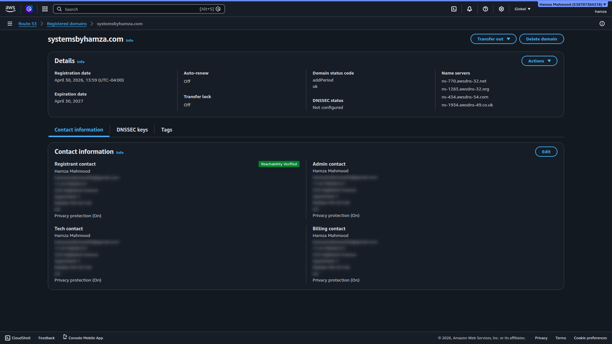

- Domain `systemsbyhamza.com` registered via Route 53
- Registration enables full DNS control

---

### Hosted Zone

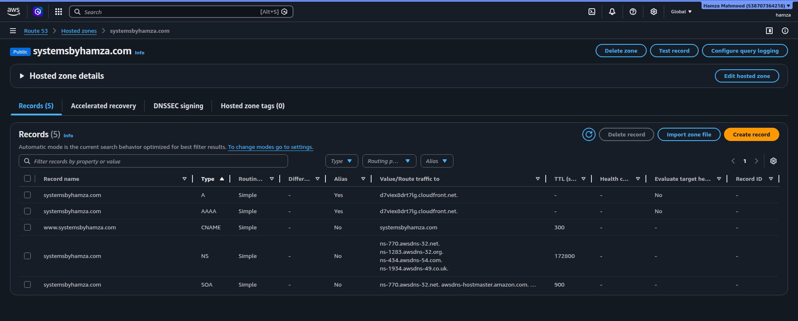

- Public hosted zone for `systemsbyhamza.com`
- Contains NS and SOA records
- Acts as the authoritative DNS zone

---

### A Record (IPv4 Alias)

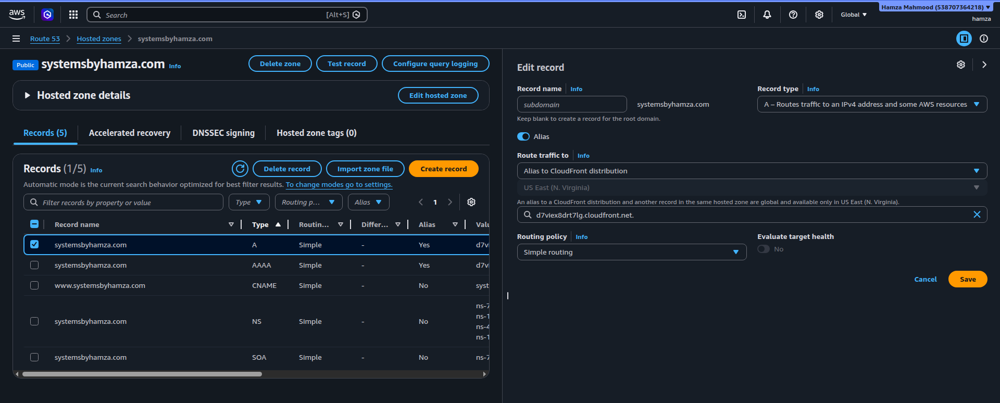

- Root domain mapped to CloudFront via alias record
- Enables IPv4 routing through Route 53

---

### AAAA Record (IPv6 Alias)

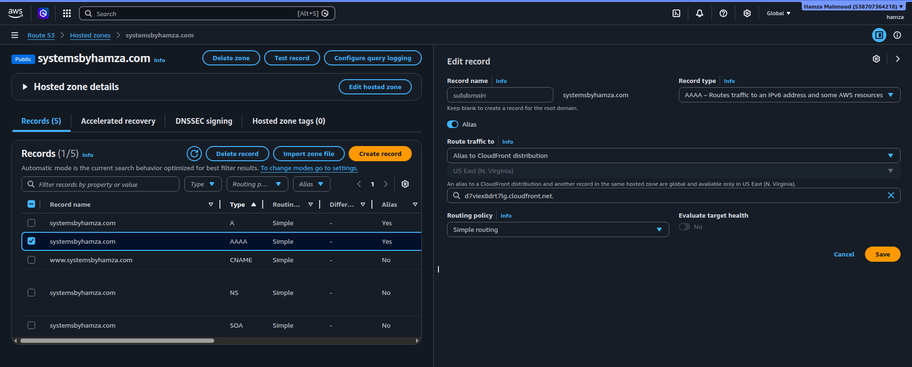

- IPv6 alias record pointing to CloudFront
- Enables dual-stack access

---

### WWW CNAME Record

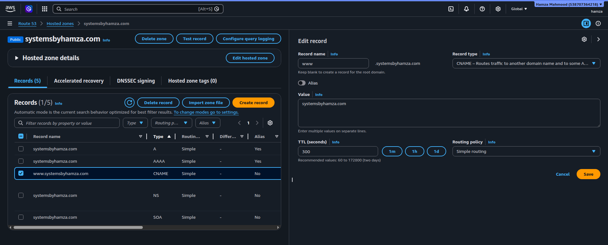

- `www` subdomain configured using CNAME
- Points to root domain

---

- Route 53 manages DNS resolution for both root and subdomain
- CloudFront is the single backend origin for all DNS paths

---

## Storage Layer (S3)

### Bucket Overview

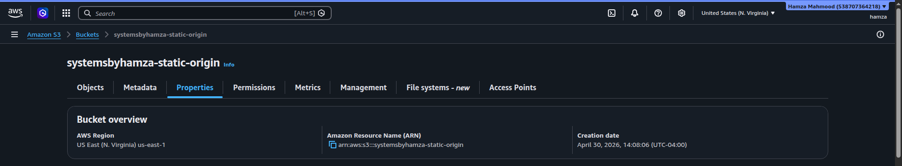

- S3 bucket used to store static website assets
- Acts as the origin for CloudFront delivery

---

### Public Access Blocked

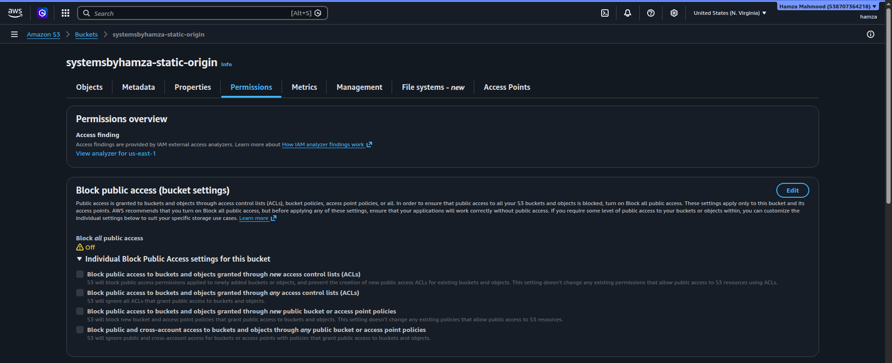

- Public access is fully disabled at bucket level
- Prevents any direct HTTP access to objects

---

### Root Object Structure

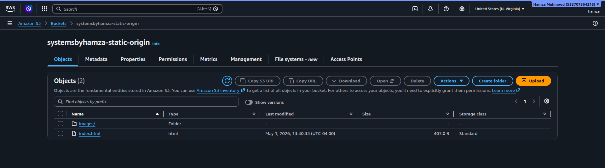

- Contains:
  - `index.html` (application entry point)
  - `images/` prefix (static assets)
- Root object is served via CloudFront default configuration

---

### Images Folder

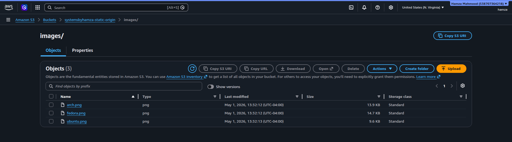

- Stores static image assets:
  - `ubuntu.png`
  - `fedora.png`
  - `arch.png`
- Referenced by `index.html` for page rendering

---

### Bucket Policy

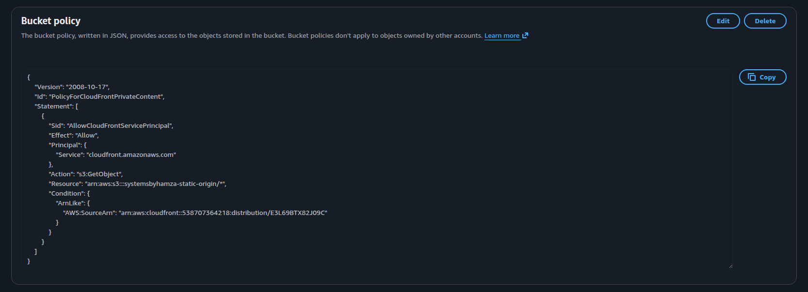

- Access restricted to CloudFront distribution via OAC
- Prevents direct S3 origin access
- Enforces controlled content delivery path

---

### Access Denied Validation

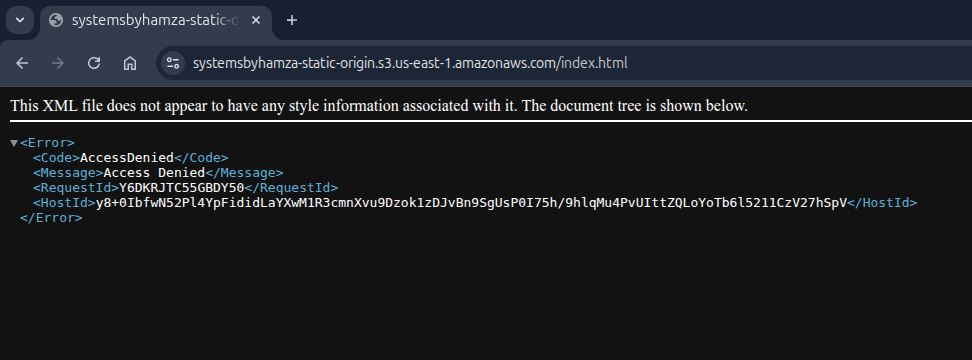

- Direct S3 object access is blocked
- Confirms origin is not publicly exposed
- Validates CloudFront as the only entry point

---

## CloudFront Configuration

### Distribution Overview

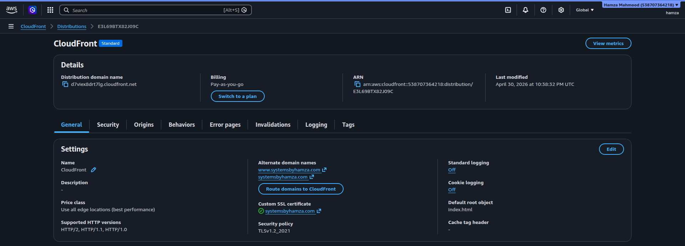

- CloudFront distribution configured as the public entry point
- Custom domain and default root object attached

---

### Origin Configuration

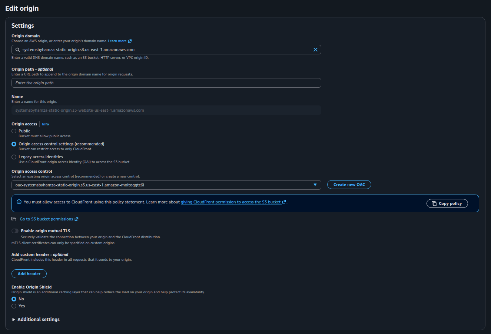

- Origin points to private S3 bucket (non-website endpoint)
- Access controlled via Origin Access Control (OAC)
- Direct S3 access is not permitted

---

### Behavior Settings

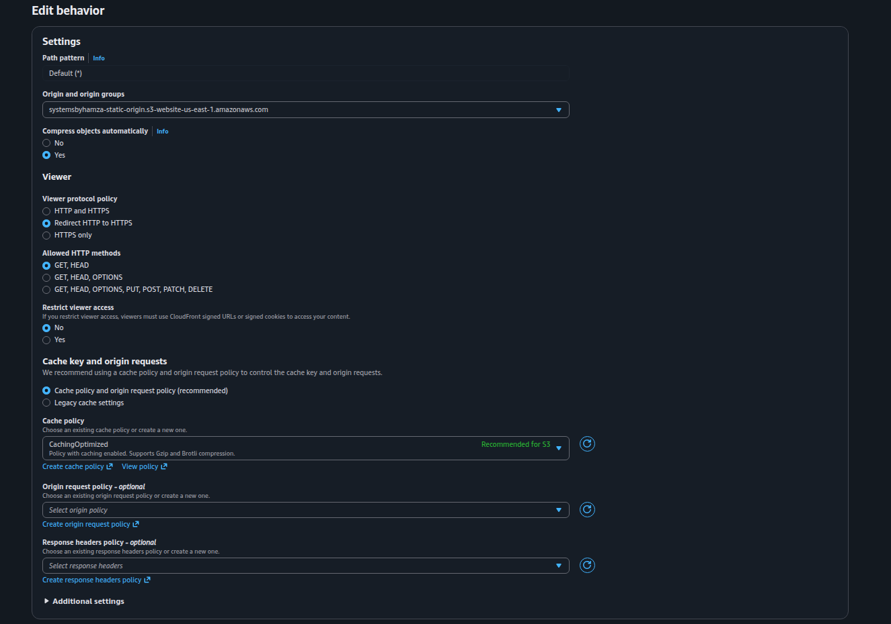

- HTTP requests are redirected to HTTPS
- GET/HEAD methods enabled for static content delivery
- Caching policies applied for edge optimization

---

## HTTPS (ACM)

### Certificate

- ACM certificate issued in `us-east-1`
- Attached to CloudFront distribution
- Enables TLS encryption for custom domain traffic

---

## Application Layer

### Homepage

- Static site successfully rendered through CloudFront
- `index.html` served as default root object

---

### HTTPS Validation

- HTTPS enabled via ACM certificate
- Browser confirms valid TLS connection for custom domain

---

### Static Asset Delivery

- Images loaded from `/images` path
- Objects retrieved from S3 via CloudFront distribution
- Confirms CDN-based asset delivery

---

## Caching Behavior

### Cache Miss

- First request served from origin via CloudFront
- Edge cache not yet populated

---

### Cache Hit

- Subsequent request served from CloudFront edge cache
- Origin not contacted

---

### Invalidation

- Cache invalidation triggered for `/*`
- Forces edge locations to refresh content from origin

---

### Cache Reset

- Cache state reset after invalidation
- Next request results in cache miss

---

- Demonstrates CloudFront request lifecycle:
  - Origin fetch
  - Edge caching
  - Cache hit optimization
  - Manual invalidation control

---

## DNS Resolution

### nslookup

- Resolves `systemsbyhamza.com` to multiple CloudFront edge IPs
- Shows Route 53 alias resolution in effect

---

### dig

- DNS query returns multiple A records
- Confirms CloudFront distribution as the resolved endpoint
- Includes both IPv4 and IPv6 responses

---

- DNS resolution maps the custom domain to CloudFront infrastructure
- Multiple IPs reflect CloudFront’s globally distributed edge network

---

## Access Paths

### CloudFront Domain

- Direct access via CloudFront distribution domain
- Bypasses Route 53 and uses CloudFront default domain name
- Validates CDN endpoint independently of custom DNS configuration

---

### Root Domain

- Access via `https://systemsbyhamza.com`
- Resolved using Route 53 alias A/AAAA records
- Routes directly to CloudFront distribution

---

### WWW Subdomain (CNAME Resolution)

- Access via `https://www.systemsbyhamza.com`
- Resolved using Route 53 CNAME record
- CNAME points to root domain, which resolves to CloudFront

---

- Demonstrates three distinct resolution paths:
  - Direct CloudFront endpoint access
  - Alias-based apex domain routing (A/AAAA → CloudFront)
  - CNAME-based subdomain delegation (WWW → apex → CloudFront)

---

## What This Project Demonstrates

- DNS resolution and routing using Route 53  
- CDN-based content delivery using CloudFront  
- Secure origin design using S3 + OAC  
- HTTPS implementation using ACM  
- Edge caching and performance optimization  
- IPv4 and IPv6 dual-stack networking  
- Private vs public access enforcement  
- Multi-service AWS architecture integration  

---

## Supporting Artifacts

This repository includes supporting materials used to validate and document the deployment:

- **[configs/](./configs/)**
  - `index.html`  
  - Image assets used for content delivery testing  

- **[screenshots/](./screenshots/)**
  - DNS configuration  
  - S3 security validation  
  - CloudFront setup  
  - HTTPS validation  
  - Caching behavior  
  - DNS resolution and access paths  

These artifacts provide reproducibility and verification of the implemented architecture.